为缅怀革命先烈，弘扬红色文化，感受革命精神，7月28日下午，华中科技大学电气与电子工程学院“五地共织文化锦，怀赤同心弘强音”赴湖北暑期社会实践队来到了坐落于湖北省武汉市武昌区红巷13号的武汉革命博物馆进行深刻的参观学习。

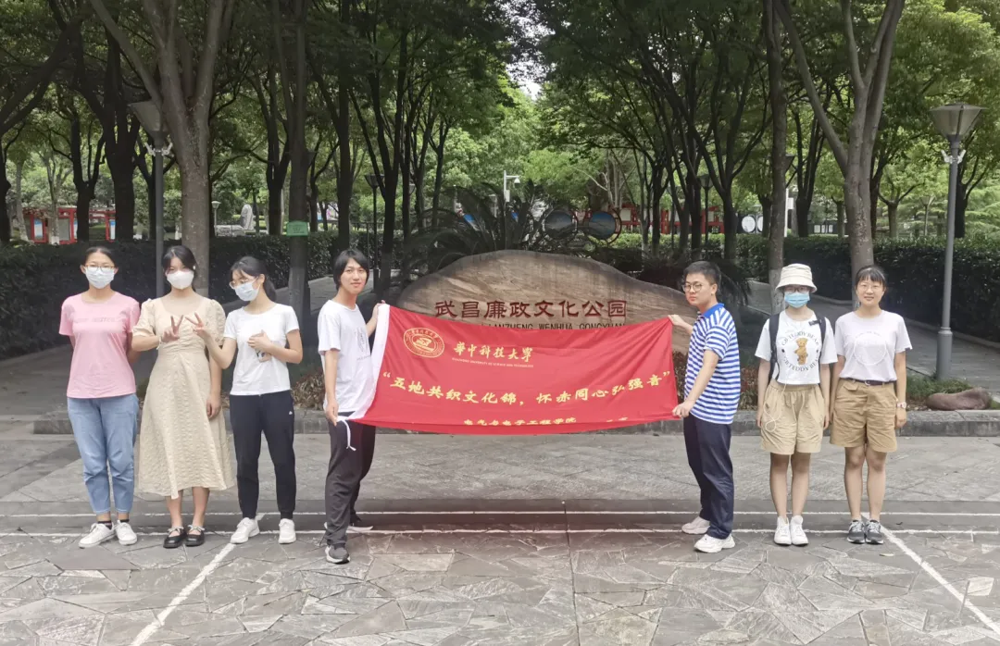
**武汉革命博物馆**
**之中共五大会址纪念馆**

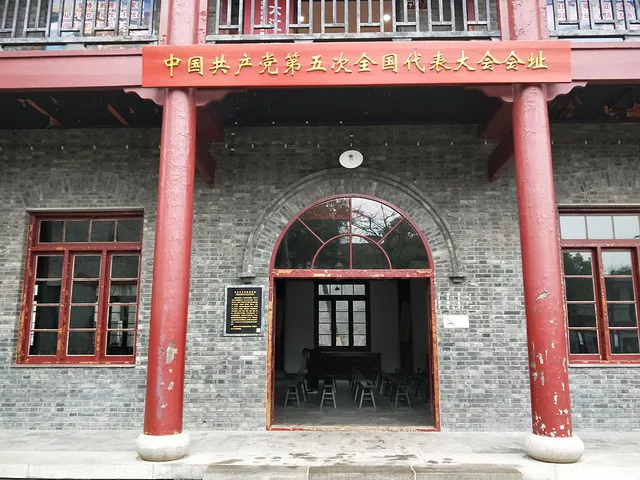

中国共产党第五次全国代表大会会址纪念馆位于“中国第一红街”——武昌都府堤20号，也是中共创始人之一陈潭秋早期活动革命旧址。中共五大会址见证了中国共产党第五次全国代表大会的召开，具有重要的历史价值与文化价值。

中共五大会址纪念馆展览包括对中共五大历史背景、筹备与召开等的具体介绍、中共五大开幕式会场、陈潭秋夫妇卧室、教室、武昌第一小学传达室和古井五个复原陈列，以及《中共五大历史陈列》、《陈潭秋在武汉》、《武汉走出的革命家、军事家、外交家——伍修权》《中国共产党反腐倡廉历程展》四个基本陈列。

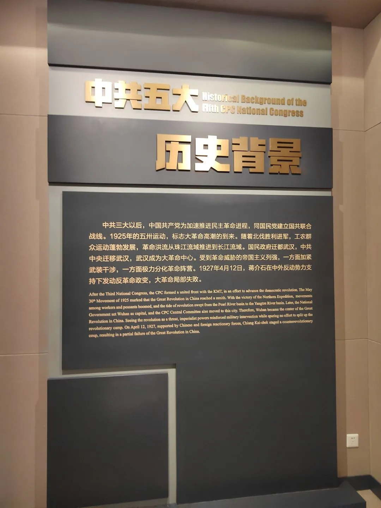

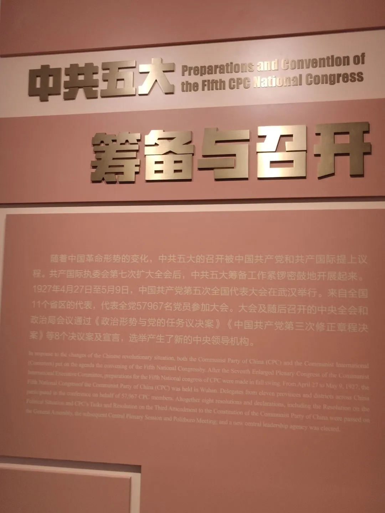

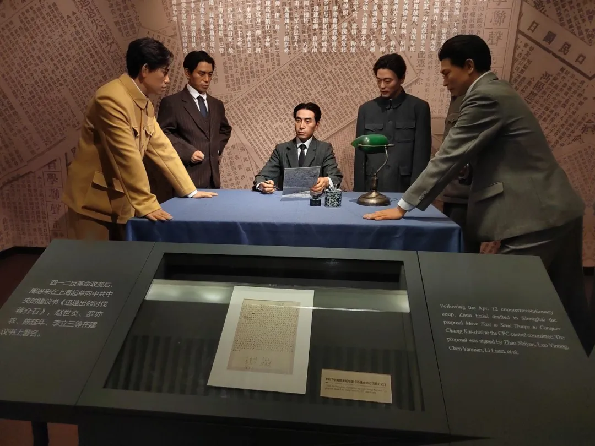

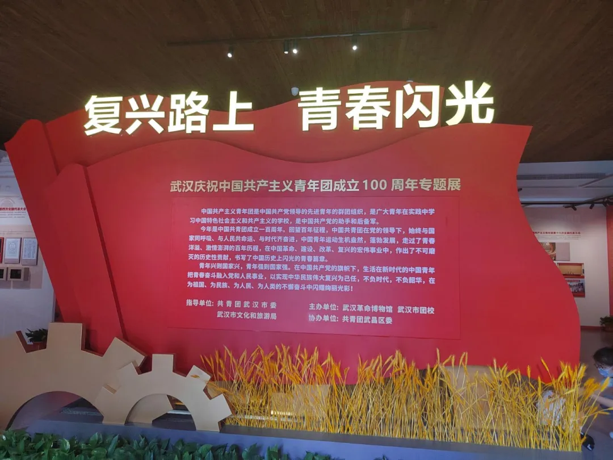

中共五大会址同时作为中共创始人陈潭秋早期活动革命旧址，向我们展现了陈潭秋在武汉的革命经历，以及陈潭秋曾经居住过的卧室，陈潭秋任教的教室等。观看《陈潭秋在武汉》基本陈列，我们领略了陈潭秋烈士的成就显著、波澜壮阔、忠于革命的光荣生命。“陈潭秋，1896年1月4日出生在湖北省黄冈县陈策楼。1912年，陈潭秋离家到湖北省城武昌读书。1920年秋天，董必武、陈潭秋等在武昌成立了武汉共产主义研究小组，在工人和青年学生中开展马克思主义的宣传和组织活动。”一句一句铿锵有力的文字之间，流露出的是一个革命烈士的奉献精神，是一个不忘初心、砥砺前行，一心为祖国、为人民的不朽灵魂。 我们，作为新时代的青年，为之震撼，亦为之感动。我们处在时代的浪潮之上，更应传承陈潭秋等烈士的伟大精神，承担起祖国复兴大任。

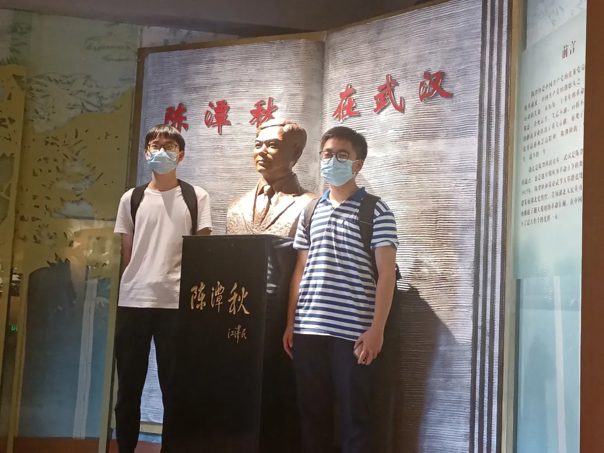

****武汉革命博物馆**
之 武昌农讲所旧址** 

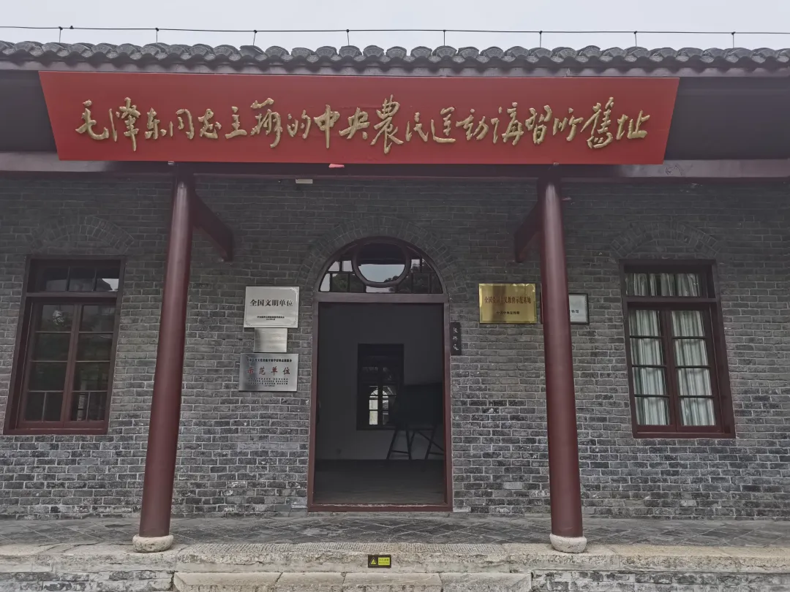

武昌中央农民运动讲习所全称“国民党中央农民讲习所”，位于武昌红巷13号。它是第一次国共合作时期，在中共推动下，由国共两党共同创办的一所培养农民运动干部的学校。1958年对旧址进行了修缮整理，按当年原貌作复原陈列，筹建纪念馆，由周恩来亲笔题写“毛泽东同志主办的中央农民运动讲习所旧址”匾额，悬挂于大门上。
1927年3月，毛泽东在武昌红巷主持创办中央农民讲习所，来自五湖四海的青年学子怀着革命的激情，汇聚到蛇山脚下，进行为期三个月的学习。
武昌农讲所培养了来自全国17个省区的800多名农民骨干，农民运动的星星之火在此孕育，革命的火种在此地孕育，红色的旌旗在此地传递。
在这里，我们看到了学生们学习的教室、休息的寝室、饮食的食堂，我们置身其中，设身处地感受到了他们曾经的生活。那是一段怎样的岁月啊！那时的他们，心中怀着无限的忠诚与热爱，秉持着坚定的信念，将自己的生命谱写成最美妙的乐章。

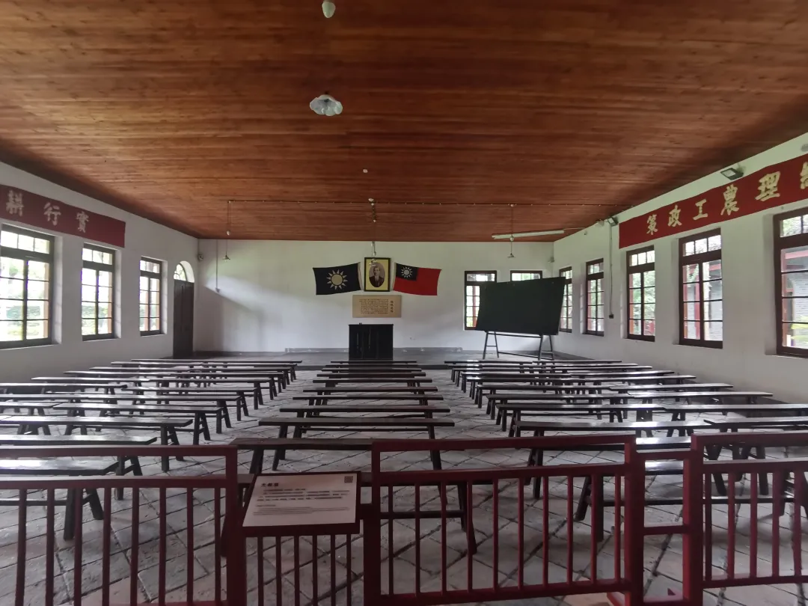
大教室
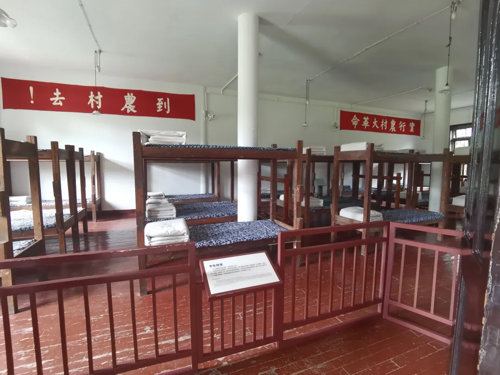
学生寝室
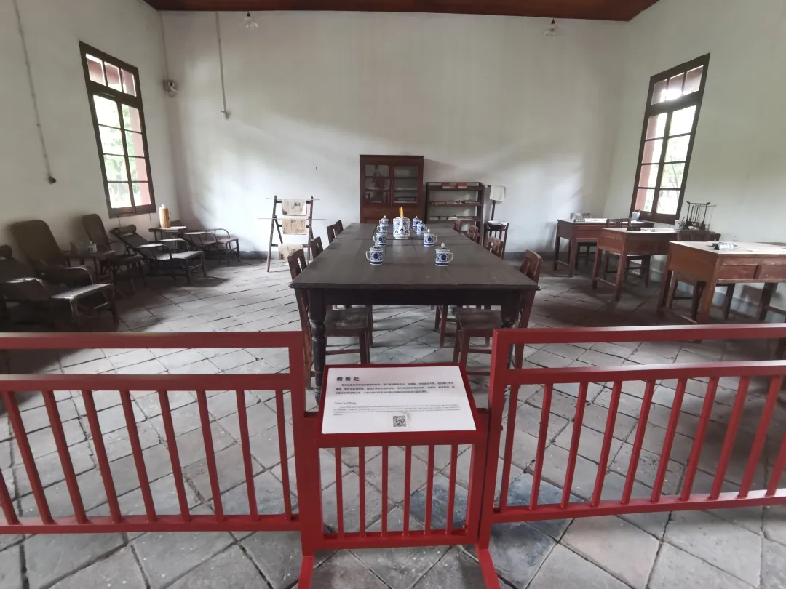

教务处

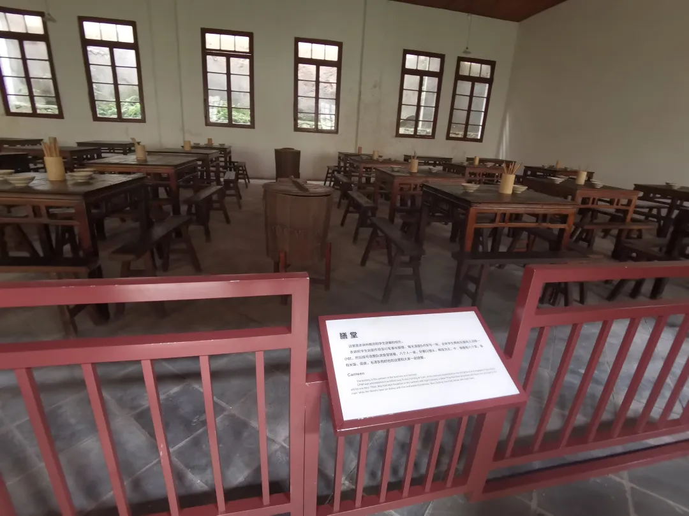
膳堂                         
社会实践队的队员们在农讲所里感受着那个红色时代的革命精神，为之感动，为之振奋。作为新时代青年，作为华中大电气学院的学子，我们应当传承革命精神，学习那个时代的年轻人的执着与坚定，牢记自己的使命，在不断奋斗中砥砺前行，为中国的建设添砖加瓦，为伟大的中国梦贡献自己的力量！
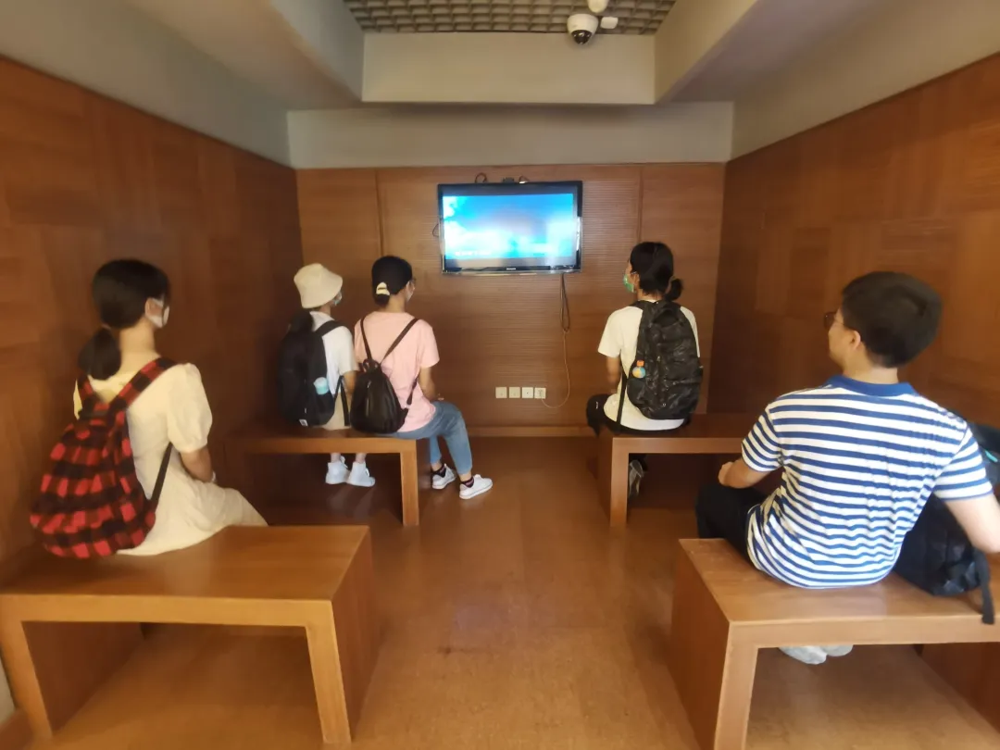
怀着崇敬与感动，社会实践队的队员们走出武汉革命博物馆。一件件革命文物，一行行泣血文字，一张张珍贵照片，一位位伟大烈士......这一切都是那一段革命光辉岁月的历史见证，是那生生不息的伟大革命精神的完美诠释，是那一位位可歌可泣的伟大革命者的永恒化身。不朽的灵魂在歌唱，时代的浪潮在翻滚。当今，我们处在“两个一百年”的历史交汇处，作为00后的我们，作为华中大电气学子的我们，作为新时代青年的我们，应当牢记自己的使命，铭记伟大的革命精神，并将其融入自己的一言一行之中。我们应当将小我融入祖国的大我，不忘初心、牢记使命、砥砺前行，在奋斗之中推动祖国的建设，在实现中华民族伟大复兴的伟大中国梦的道路上无限驰骋！
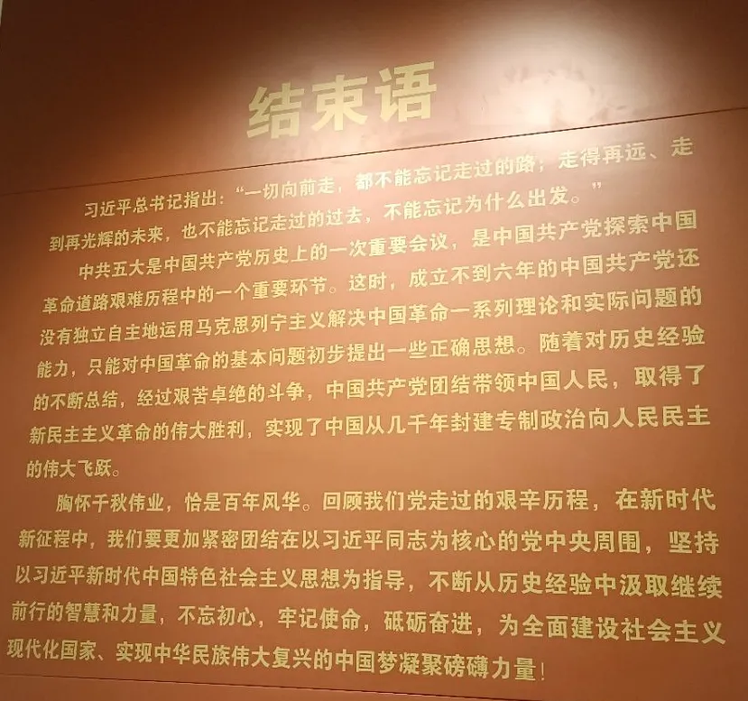