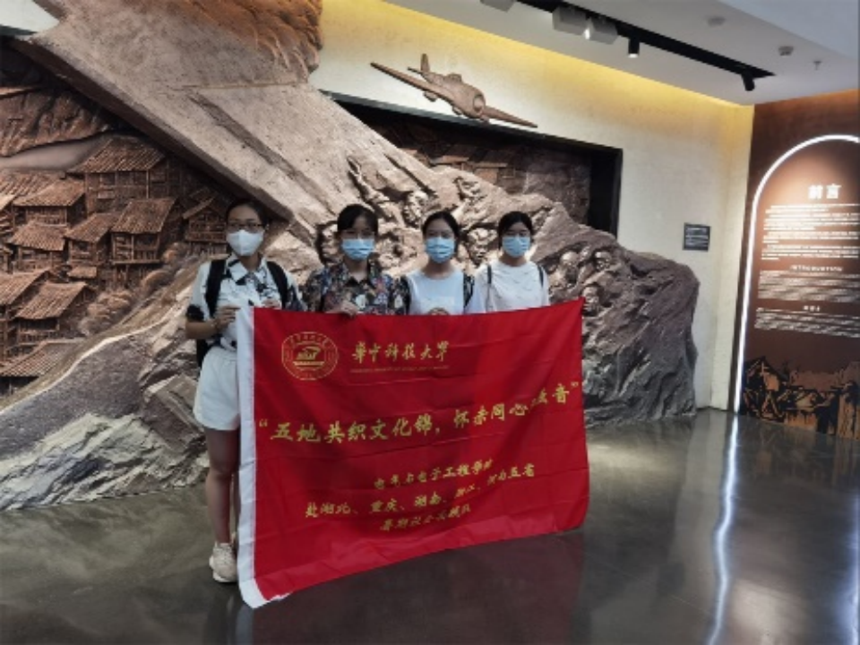
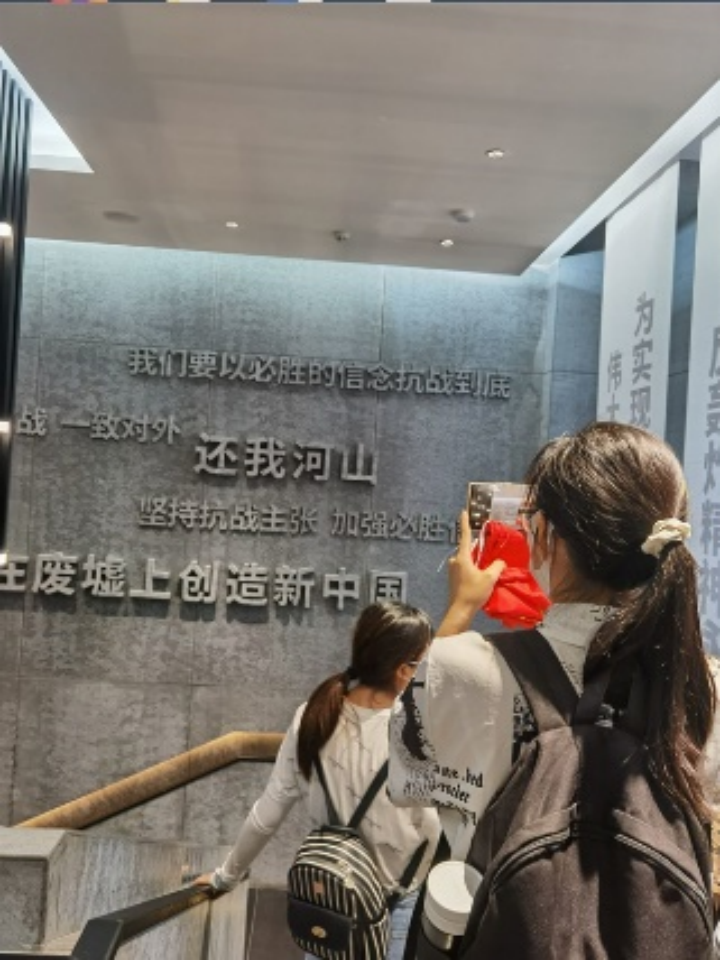
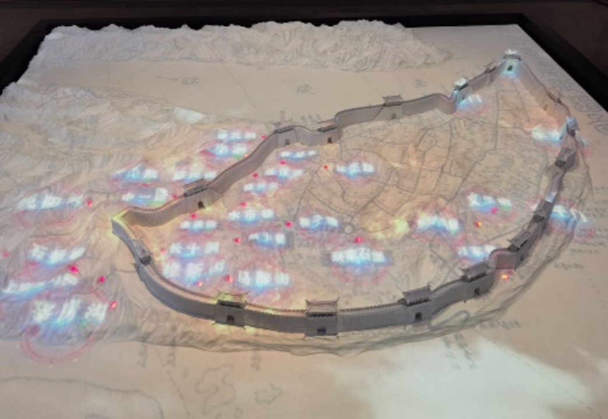
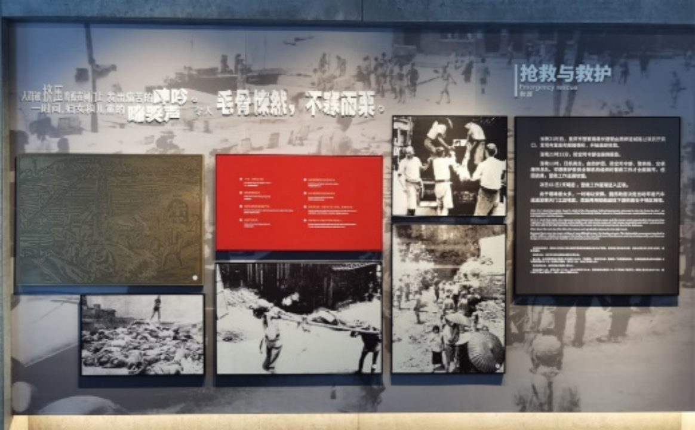
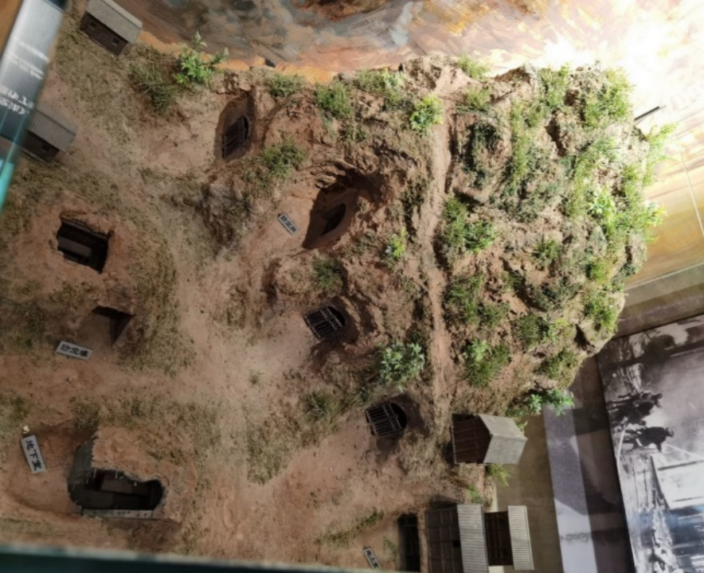
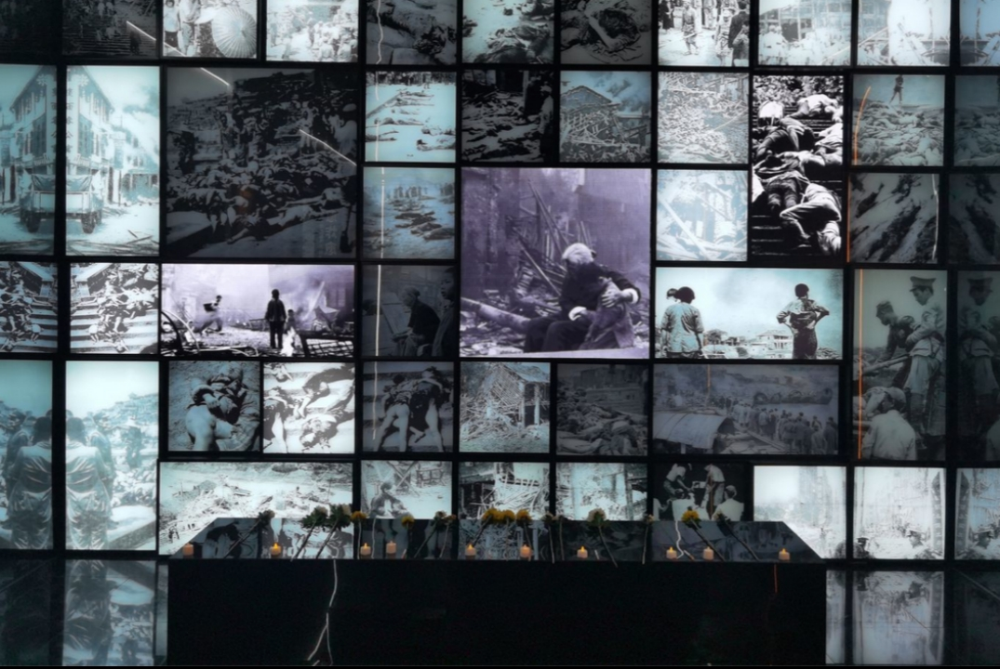

 

2022年7月29号下午，我们一行人——红色文化暑期实践之重庆四人分队——到达了位于渝中区的重庆大轰炸“六五”隧道惨案史实展馆。

室外酷烈的阳光使万物喧嚣，馆内的环境却清幽肃穆，访客们自觉静默地阅读这段历史，惟留雕塑墙上重庆人们在隆隆轰炸中无声呐喊，那峥嵘岁月中中华儿女的不屈信念和乐观的抗战精神铭刻史册。

“还我河山！”在中华儿女震耳发聩的心声中穿行，我们正式抵达了展馆入口。烟尘在立体包围式大屏幕上炸开，墙上的刻字记录着大轰炸带来的触目惊心的伤害，我们仿佛回到了1941年6月5日那天，身处炼狱，哀鸿遍野。 

1941年6月5日夜晚，24架日机分三批偷袭重庆渝中区，造成十八梯、石灰市和演武厅三段防空隧道内避难民众窒息、践踏，伤亡2500人左右，酿成了第二次世界大战中间接死于空袭人数最多的“六五”大隧道惨案。场馆运用场景雕塑影视艺术手法，结合同期声、光影特效等技术，逼真还原“六五”隧道惨案的场景，所采用的交互式设计，使侵华日军轰炸重庆的场景在我们眼前清晰复现，其中展示的多种炸弹伤害模拟，更是让我们得以管中窥豹，探得当年重庆人民所受伤害之微毫。

展区还设有“重庆防空大隧道”虚拟漫游，复原了当年重庆防空大隧道的走向及其内部环境，在指定区域做踏步动作，即可实现“漫游防空大隧道”的仿真体验，直观了解战时隧道的情况。旁边便是介绍当时重庆的惨烈战况的相关图文，墙上的屏幕循环播放着当年亲历者对大轰炸经历的自述。在展览的科普下，我们才得知进入防空洞需要防空证，且购买此票的费用不菲，需要数两黄金。因此，普通民众的生命更难以得到保障。在大轰炸时，缺少庇护的他们只得四散奔逃，却无能为力地匍匐在炸弹的威力下，尸横遍野。

但是中华儿女永不屈服，重庆人民越炸越勇。纪念馆利用隧道交叉口的开阔空间，打造沉浸式剧场，采用纪实手法，展示了日机轰炸重庆期间，重庆市民乐观生活、躲避警报、消防灭火等珍贵历史画面。馆内展出的防空洞模型，具体地展现了重庆人民不屈不挠、誓与敌人斗智斗

勇抗争到底的坚韧意志。

重庆大轰炸被认为是与南京大屠杀同等性质的事件，面对此等惨案，我们怎能沉默？会馆以亲历者的口述为基础，通过两侧墙面的局部投影、造景，同步演绎亲历者讲述的画面，构成一幅完整的视听实录，打造半独立式口述剧场。老人对当年混乱的追忆让人不忍卒听，将士们对抗争战况的复述使我们愤恨之余更觉慷慨激昂。

习近平总书记说道：“在中国人民抗日战争的壮阔进程中，形成了伟大的抗战精神，中国人民向世界展示了天下兴亡、匹夫有责的爱国情怀，视死如归、宁死不屈的民族气节，不畏强暴、血战到底的英雄气概，百折不挠、坚忍不拔的必胜信念。伟大的抗战精神，是中国人民弥足珍贵的精神财富，永远是激励中国人民克服一切艰难险阻、为实现中华民族伟大复兴而奋斗的强大精神动力。”

此刻身处重庆大轰炸“六五”隧道惨案史实展馆，现代科技与传统艺术相结合，使这一波澜壮阔的抗战画卷在我们眼前徐徐展开。先辈们挥洒的革命热血从未干涸，而是化作历久弥新的红色文化，注入中华民族强有力的时代脉搏。“天地英雄气，千秋尚凛然。”此时，我们只能将自己的一片心意化作点点烛火、束束鲜花，聊以宽慰那些逝去的英灵，也向不屈的革命的华夏儿女致以最崇高的敬意。

