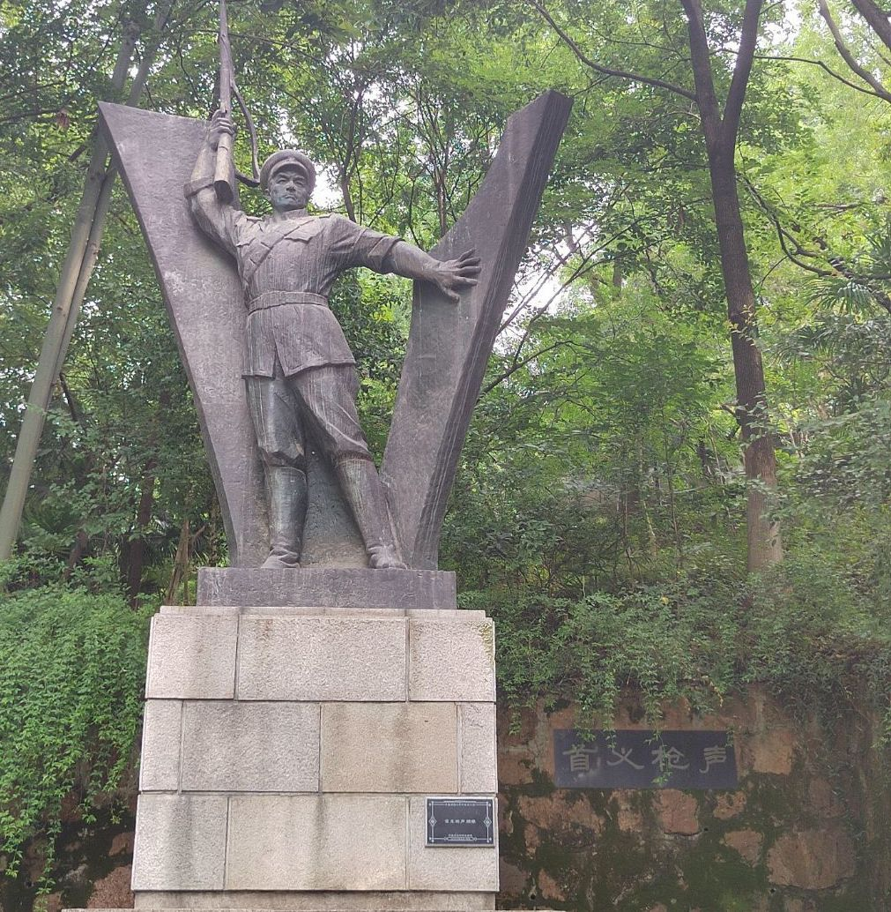
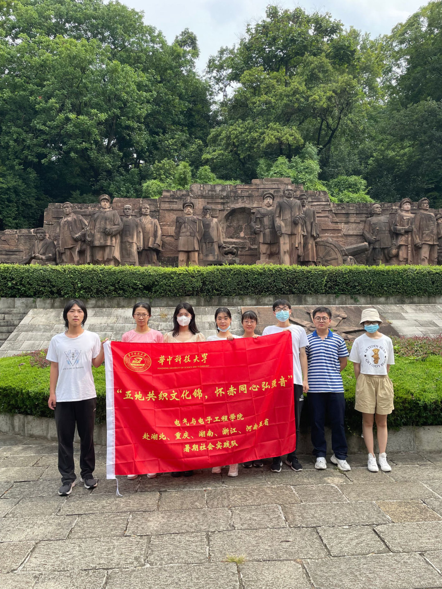
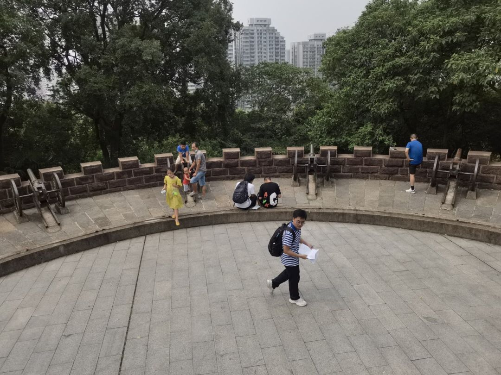
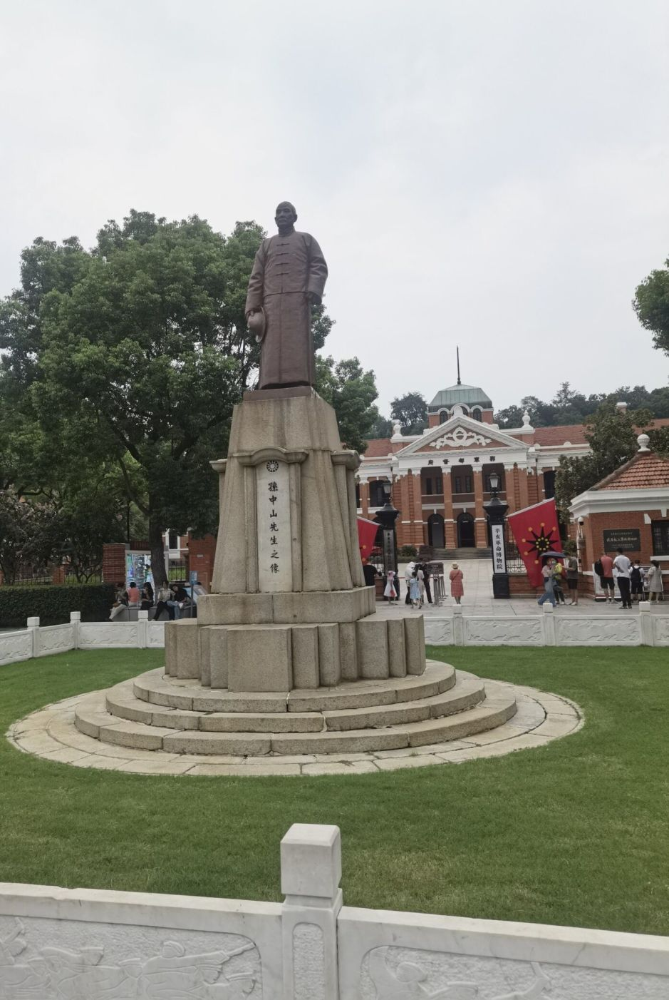
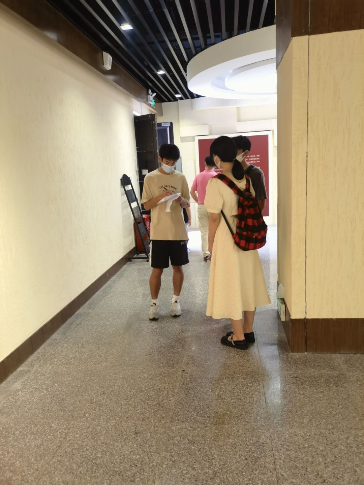
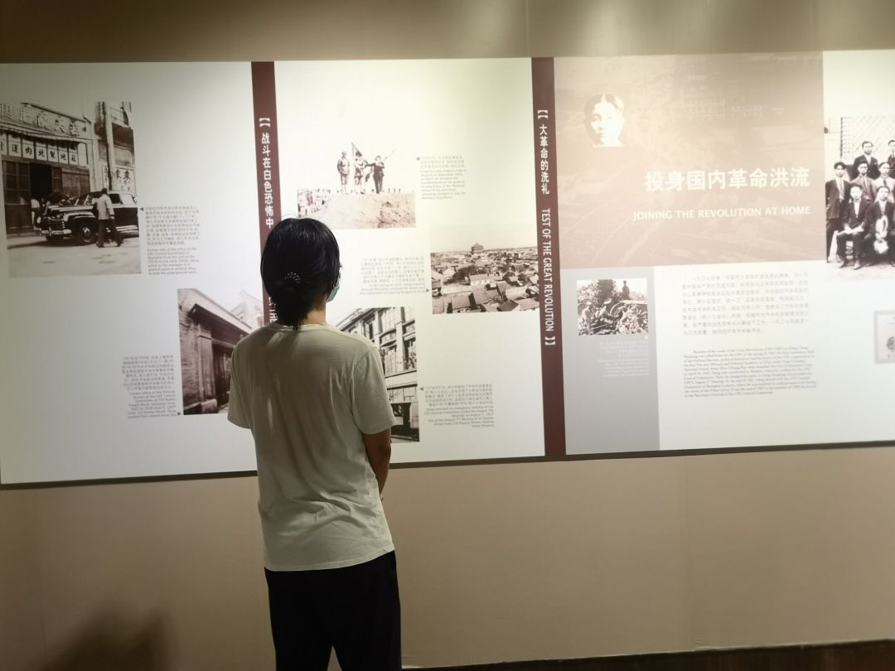

**湖北省武汉市**，一座拥有深厚革命文化底蕴的城市。辛亥革命的首义之地**首义公园**、武昌革命的纪念地**辛亥革命武昌起义纪念馆**、**武汉农民运动讲习所**等等标志地星罗棋布在武汉各地，共同编织了武汉这座城市独特的文化魅力和历史风貌。为了感受武汉革命文化的魅力，我们赴湖北小组计划了这几天的文化探索之行。

7月28日上午9点，我们小组一行八人首先来到了武汉首义公园。首义公园位于湖北省武汉市武昌区蛇山上，隶属国家AAAA级旅游景区武昌首义文化旅游区，始建于1923年，为16.6公顷。是武汉市唯一的以辛亥革命为主题的纪念性公园。首义公园拥有长达百年的历史，目睹了从中华民国到中华人民共和国的历史，经历了兴衰变迁。

1921年由首义人士夏道南等人倡议筹建首义公园，两年后开始筹建。湖北省政府将蛇山全部辟为武昌公园，取消首义公园。武昌公园虽设有管理所，但管理仍无起色，致使公园荒废。1938年武汉沦陷后，公园一度荒芜。抗战胜利后，1946年6月经湖北省参议会提议，将蛇山公园再度改称首义公园，延用至今1950年3月在华中大学、华中农学院、湖北省军区等39个单位的大力协作下，种植5万余株侧柏，现已繁茂成林。19世纪50年代建设武汉长江大桥时，拆迁胖像宗塔、涌月台、禹碑、碑廊、黄兴铜像等。该园转移到武昌路以东的"抱冰堂"一带，大门移到武珞路，与湖北省图书馆紧邻。陈友谅墓、黄鹤楼茶社等仍由该园管理。园内有"梅廊"、"抱冰堂"、"岳飞亭"、"和平亭"、养鱼池、小桥等景点。

经过一段不算陡峭的山路，我们到达了辛亥革命纪念碑，这里是半山腰，有一个大平台，有许多老人在这里做着各式各样的锻炼。看到一些坐在旁边休息的老人，我们便迎上去，拿出事先准备好的问卷让他们填写，有些老人视力不好，我们的队员便通过闲聊的方式，在与老人的对话中获取信息。

继续向上，我们隐约听到了笛声。顺着笛声，我们寻到了山顶的一条小路，这条小路一直往西，一路上也是看到了许许多多的老年人。他们怡然自得，或吹笛，或舞剑，或闭目养神，我们不便打扰，继续前行。走到蛇山武昌起义军炮台，我们终于见到了年轻人的身影。他们是一家人一起来的，哥哥在读高中，还有两个上小学的弟弟妹妹。在和他们的交谈中，我们得知他们不是武汉本地的，他们是暑假从黄冈来旅游的。这里还有一个老太太，神情激动，拉着我们，用我们听不太懂的方言讲着什么，大概是说当年这里有多少多少人打仗。我们虽然听不太清楚，但是能感受到她的热切，她想向我们年轻一辈传递革命精神。我们也暗自下定决心，一定铭记历史，让这一份红色基因传承下去。

随后，我们达到了此行的第二个目的地——辛亥革命武昌起义纪念馆。辛亥革命武昌起义纪念馆，是依托中华民国军政府鄂军都督府旧址而建立的纪念性博物馆，位于湖北省武汉市武昌区武珞路1号，占地面积20000多平方米，建筑面积近10000平方米。1911年10月10日，在孙中山民主革命思想的旗帜下集结起来的湖北革命党人，蓄势既久，为天下先，勇敢地打响了辛亥革命的"第一枪"，并一举光复武昌。次日在此组建中华民国军政府鄂军都督府，推举湖北新军协统黎元洪为都督，宣告废除清朝宣统年号，建立中华民国。随即，辛亥革命领袖之一黄兴赶赴武昌，出任革命军战时总司令，领导了英勇悲壮的抗击南下清军的阳夏保卫战。武昌义声赢得全国响应，260余年的清朝统治顿时瓦解，2000多年的封建帝制随之终结。武昌因此被誉为"首义之区"，红楼则被尊崇为"民国之门"。

这里的人比首义公园要多，也更加集中。基本上都是父母带孩子来的，相比于公园里面的老年人这里父母的学历普遍高一点，基本上是本科或者研究生毕业，他们非常愿意配合我们的调查，经过和他们简单的交谈，我们感觉到现在父母还是比较注重对孩子的红色教育的。

经过一早上的参观，我们都感触良多、受益匪浅。首义公园栩栩如生的历史人物浮雕仿佛带我们回到了那个战火纷飞的时代，革命领袖们身先士卒，带领中华民族突出重围，迎来生机和希望。辛亥革命武昌起义纪念馆中呈现的历史遗迹真物让人感受到那个年代的艰苦条件，伟大的革命先辈们仿佛近在眼前。辛亥首义文化既凸现了荆楚文化的地域特色，又反映了中国优秀传统文化的精神，还具有鲜明的时代性，对后来的中国革命产生了深刻的影响，是中国近代历史文化主题的体现，集中反映了近现代中国人民的爱国主义精神，极大地解放了人民的思想，推动了历史的进步，展示了中华文化生生不息的生命力。

**作为新一代的青年，我们是国家未来的栋梁和希望，实现中华民族伟大复兴的历史重任自然落在我们的肩头。吾辈诚应发愤图强，立志于心，立足于行，传承和发扬革命精神。**

 作者 王雅钰 

 编辑 熊力蒙       

