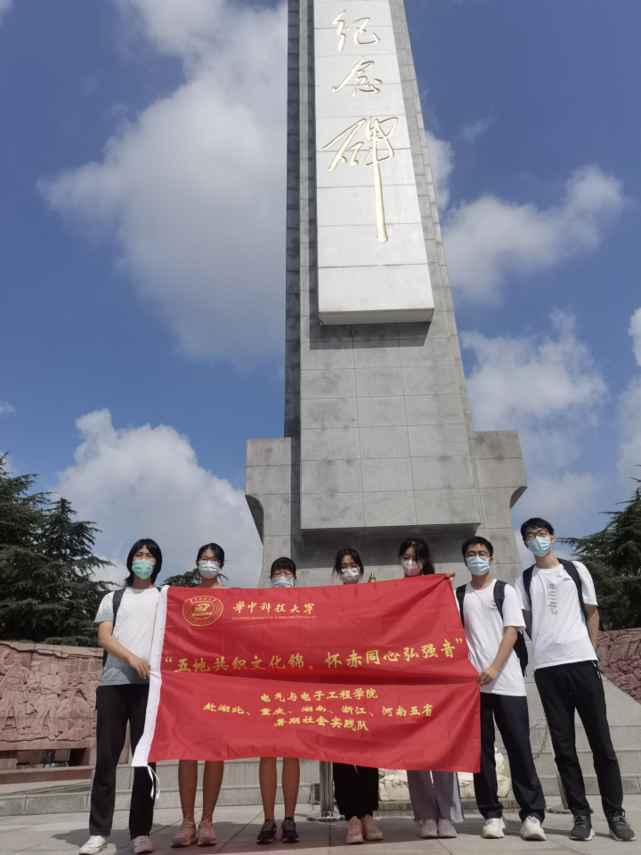
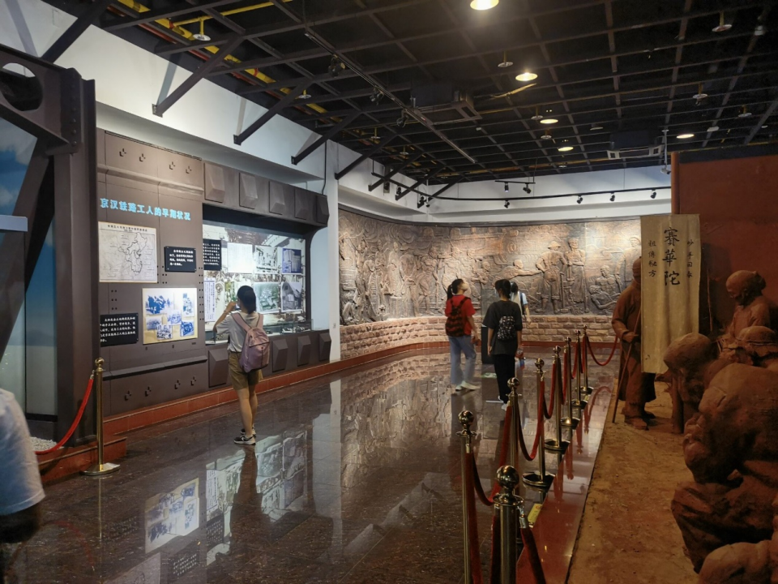
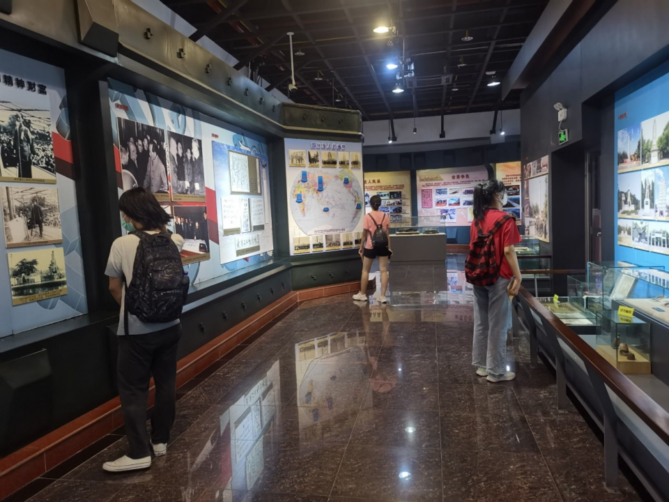
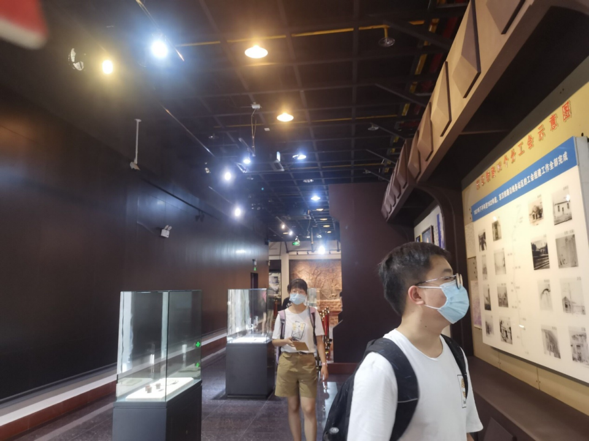
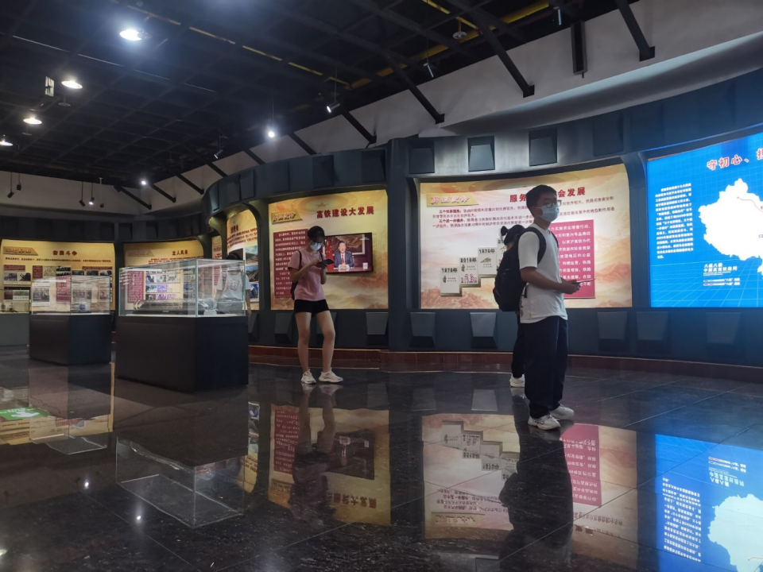
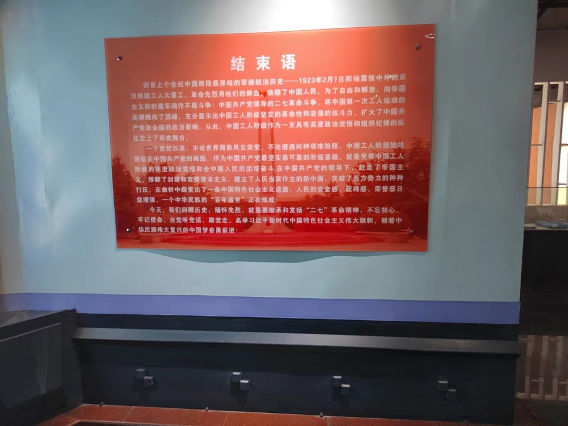

2022年7月29下午，为重温老一辈革命情怀，探究当今红色景点的受欢迎程度与教育意义，华中科技大学电气与电子工程学院赴湖北暑期社会实践队来到位于武汉市江岸区的“二七”纪念馆。现在，跟随我们的脚步一探究竟吧。

**1999年建成的二七烈士纪念碑**

新落成的二七烈士纪念碑为大理石贴面，碑身高23.27米，寓意1923年2月7日。基座为钢轨造型，基座正面是锻铜汽笛，汽笛下方石牌上刻有“1923.2.4”，正是这一天，林祥谦的怀表指向9时，工人黄正兴拉响汽笛，京汉铁路全线总同盟罢工开始了。纪念碑两侧为长30米、高3.2米的赭红色花岗岩弧形雕塑群，由8幅浮雕和圆雕组成，艺术地再现了二七革命斗争中的重大事件和代表人物。纪念碑群坐落在方圆结合直径为27米的花岗岩底座上，底座背面，刻有“湖北省暨武汉市人民敬立”的《二七碑文》，纪念碑群庄严肃穆，气势磅礴，寓意深刻。 [1]

 

二七纪念碑前合照

武汉二七纪念馆主展厅共分三个展厅七个部分，陈列着二七革命斗争的史料与文物、油画和场景等。馆内收藏有 清光绪三十一年（1905年）竖立于黄河桥头的铸铁纪念碑、林祥谦烈士的怀表、江岸京汉铁路工会会员证徽章等主要文物。下图为实践小组在参观第二部分：铁路工人运动蓬勃兴起、第三部分:京汉铁路总工会的成立与斗争。

 

组员参观

 

 

 行进途中，我们向沿路的同行旅客发放问卷，调查他们来到这里的缘由与游览结束的收获。大部分游客是因公司团建集体前往，接受红色教育；也有许多大、中、小学生参加纪念座谈会，组织凭吊及慰问活动，追忆革命先烈，传承二七精神。

 

通过这次实践活动，我们的身心被伟大的二七精神充分浸润。革命先辈们的鲜血不会白流，沿着历史的河道，神州大地处处闪耀着二七精神的光芒。新中国成立后，铁路工人始终站在时代的前沿，在社会主义建设和改革开放中，为共和国的建设和经济发展创造了不可磨灭的历史功绩。他们艰苦奋斗，万众一心，顽强拼搏，无私奉献，为中国铁路高速发展、一步步走向世界前列做贡献。
