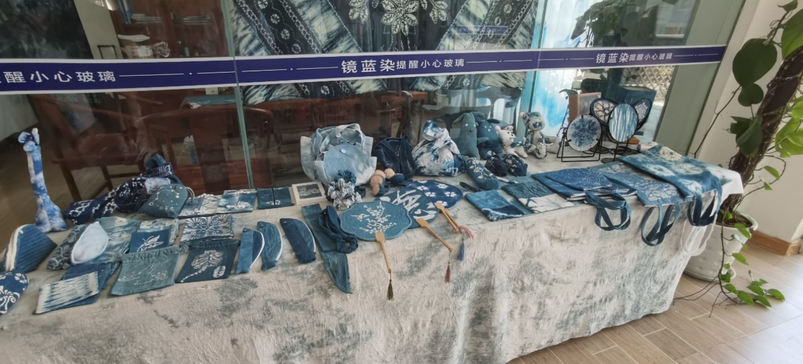

8月1日下午，电气与电子工程学院赴湖北、重庆、湖南、浙江五省十二地共织文化锦，怀赤同心弘强音暑期实践队重庆分队赴三河村参观了解扎染和陶瓷的烧制。

 **观扎染之技法，兴传统之文化**

8月1日上午，三河村坐落于重庆市沙坪坝区，在采访中我们得知三河村将要建设成一个具有艺术氛围的村落，其中不乏有传统的扎染，瓷器。扎染古称扎缬、绞缬，古代常见的防染印花纺织品有绞缬、蜡缬和夹缬等种类。是汉族民间传统而独特的染色工艺。织物在染色时部分结扎起来使之不能着色的一种染色方法，中国传统的手工染色技术之一。扎染工艺分为扎结和[染色](https://baike.baidu.com/item/染色/5871622)两部分。它是通过纱、线、绳等工具，对织物进行扎、缝、缚、缀、夹等多种形式组合后进行染色。 其[工艺特点](https://baike.baidu.com/item/工艺特点/12721828)是用线在被印染的织物打绞成结后，再进行印染，然后把打绞成结的线拆除的一种印染技术。它有一百多种变化技法，各有特色。如其中的“卷上绞”，晕色丰富，变化自然，趣味无穷。更使人惊奇的是扎结每种花，即使有成千上万朵，染出后却不会有相同的出现。这种独特的艺术效果，是机械印染工艺难以达到的。作为新时代的青年，作为华中大电气的学子，我们有责任传承和弘扬传统文化，我们身上肩负的不止自己，还有中华民族的复兴之梦，还有弘扬传统文化的责任。

**悟瓷器之美，承传统之技**

8月1日下午，我们来到了三河村缙泉烧体验参观瓷器的制成。我们在工作人员的带领下体验了如何自己用瓷土，配合手法做成我们常见的瓷器，如碗、碟子等。中国瓷器从陶器发展演变而成的，[原始瓷器](https://baike.baidu.com/item/原始瓷器)起源于3000多年前。至宋代时，名瓷名窑已遍及大半个中国，是瓷业最为繁荣的时期。当时的[汝窑](https://baike.baidu.com/item/汝窑)、[官窑](https://baike.baidu.com/item/官窑)、[哥窑](https://baike.baidu.com/item/哥窑)、[钧窑](https://baike.baidu.com/item/钧窑)和[定窑](https://baike.baidu.com/item/定窑)并称为[宋代五大名窑](https://baike.baidu.com/item/宋代五大名窑)，当时比较有名的还有[柴窑](https://baike.baidu.com/item/柴窑)和[建窑](https://baike.baidu.com/item/建窑)。面对如此精美的瓷器，队员们纷纷感叹中华传统文化之美，也更加坚定了我们要弘扬传统文化，将其传承下去。在体验制作瓷器时，队员们遇到了许多困难，也体会到了烧制瓷器的不容易，坚定了弘扬传统文化的信念。

 
 

 

 
