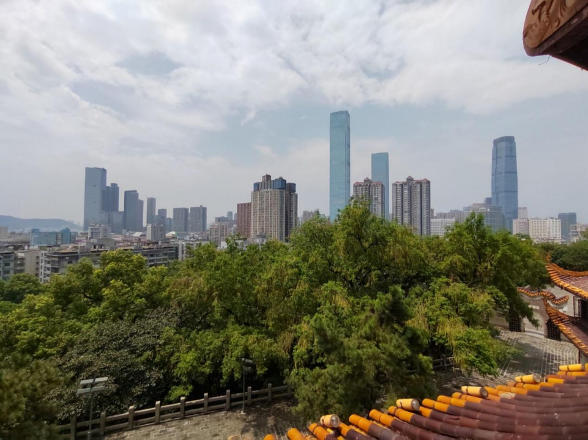

走进天心阁：触摸长沙历史遗迹，感受湖湘文化脉络

为追忆中华民族峥嵘往事，体验璀璨文化，传承优秀传统文化，厚植青年学生民族和文化自豪感，培养爱国主义情怀，7月28日华中科技大学电气与电子工程学院湖南实践队前往湖南天心阁进行参观学习。

 

咸有一德，克享天心

 天心阁系乾隆十一年（1746）由抚军杨锡被主持兴建。阁名引《[尚书](https://baike.baidu.com/item/尚书)》“咸有一德，克享天心”之意得名。阁楼总建筑面积864平方米，当时为全城最高处。解放后市政府将其列为文物保护单位。阁体乃1983年重建，仿木结构，栗瓦飞檐，朱梁画栋，主副三阁，间以长廊。整个阁体呈弧状分布。主阁由60根木柱支撑，上有32个高啄鳌头，32只风马铜铃，10条吻龙。阁前后石栏杆上雕有62头石狮，还有车、马、龙、梅、竹、芙蓉等石雕，体现了长沙楚汉名城的风貌，另外阁内还珍藏了许多名人字画。天心历史——长沙筑城，始于西汉[高祖](https://baike.baidu.com/item/高祖)五年。[刘邦](https://baike.baidu.com/item/刘邦)立汉，封重臣[吴芮](https://baike.baidu.com/item/吴芮)为长沙王，置[长沙国](https://baike.baidu.com/item/长沙国)，都长沙，始筑土城。由汉迄宋，随着社会发展，城池亦向南北两向渐次扩展。至元代广袤已形定局，但城垣形状仍较简陋，明初，才垒址以石，使之“上下完固”。清顺治十一年，[洪承畴](https://baike.baidu.com/item/洪承畴)拆明朝诸藩王府之藩城砖，尽数用以修筑城垣，使其增高加厚。此后又续修建，设有窝铺、更栅，增修城楼、炮台、垛口，为之一新。辛亥以后，为了发展贸易和交通，拆除城墙，修筑环城马路，因阁峙城头之故，存此一段。在古厝回廊，碧瓦飞檐，朱梁画栋之间，实践队感受到了先贤惊才绝艳的艺术，天人合一的哲思，忠君爱国的情怀。在体验天心阁的宏伟壮丽中，实践队更加坚定了传承民族精神，宣扬传统文化的决心。

极目千里，瞰阁万家

“楼高浑似踏凌空,四面云山屏障同。指点潭州好风景,万家烟雨画图中。”天心阁楼阁高耸,碧瓦飞檐,朱梁画栋,似山峦起伏,错落有致,气势宏伟。立于天心阁三楼，极目远望，湘江远去，第一师范的青砖白瓦，现代化都市的繁华绚丽尽收眼底，氤氲出博大的胸怀与文化自豪感。在一次次的极目远眺中，实践队感受到了中华民族广博宏大的气度和历久弥新和光辉灿烂的文化。

几度罹难，传承不断

天心阁历史悠久。历史上，天心阁曾多次遭受变故。1938年11月13日，凌晨两点发生“文心大火”，天心阁被毁。其时，中共中央革命军事委员会副主席兼国民政府军事委员会政治部副部长周恩来正在长沙。11月16日，他曾登临天心阁城墙，视察灾情，并组织共产党人为主的政治部三厅人员投入救灾。现在的天心阁早已不复当年模样，但刻在天心阁上“犯难而志其死，所欲有甚于生”的爱国主义精神却代代相传，相沿至今。

 

勇武忠国，舍生忘死

天心阁原作城墙抵御敌军之用，屡经战事。他见证了太平天国的兴盛与衰落，目睹了辛亥革命的胜利与混治，承载了一代代爱国主义将士抵御外辱，反抗侵略的宏愿，象征中华民族 勇武忠国，舍生忘死的爱国主义精神。“犯难而志其死，所欲有甚于生”，这一句刻在天心阁上，也永远刻在了中华名族的精神谱系中。

一件件古代物事，一张张精美照片，一段段光辉历史，是千年峥嵘岁月的见证，更是催人奋进的力量源泉。当前，我们正处在“两个一百年”的历史交汇处，我们要时刻铭记渡江战役的辉煌历史，感悟和传承伟大的中华名族优秀传统文化。“犯难而志其死，所欲有甚于生”的爱国主义精神将会一直激荡在我们心中，激励着我们继续谱写属于新时代青年的故事，继续为实现中华民族伟大复兴贡献更大的力量！
