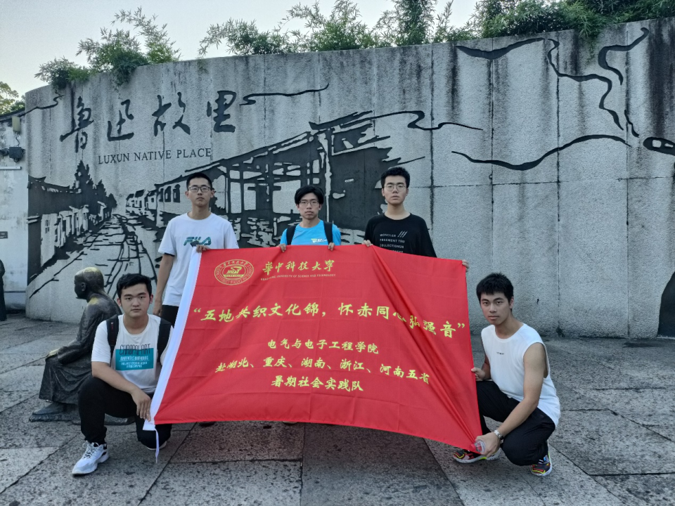
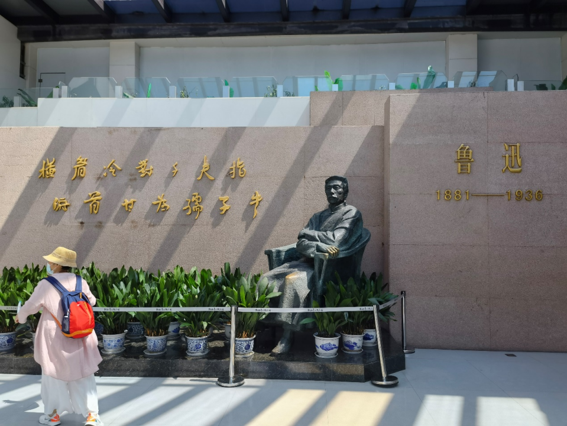
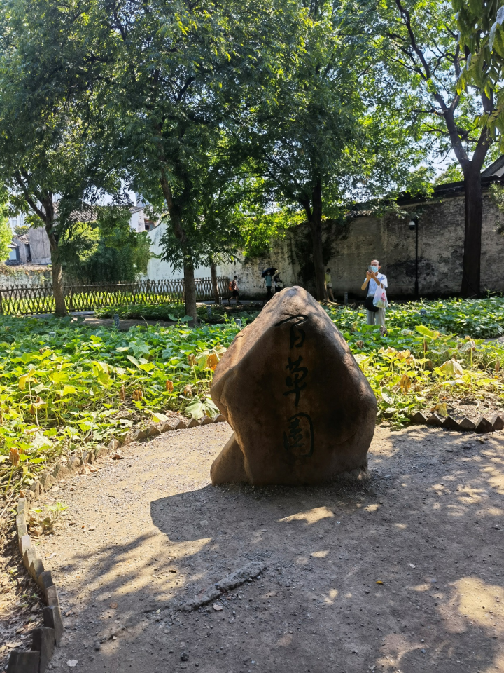
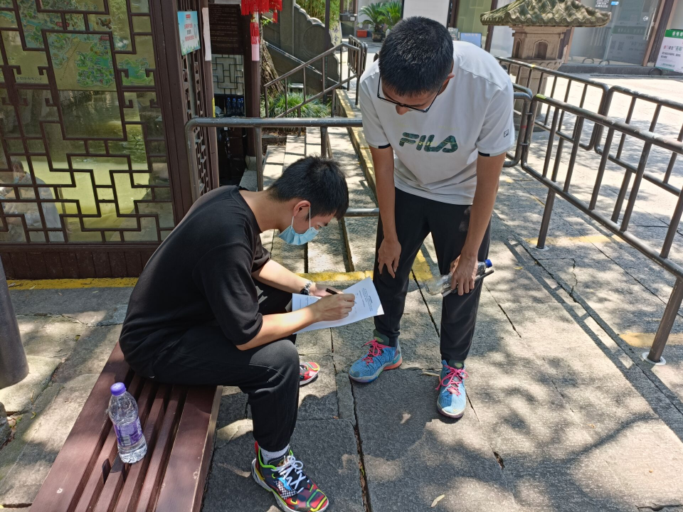

为了解鲁迅先生的生平事迹，学习鲁迅先生身上不屈不挠的革命精神，培养青年爱党爱国爱社会主义的情怀，7月29日电气与电子工程学院赴湖北，重庆，湖南，浙江，河南五省“五地共织文化锦，怀赤同心弘强音“暑期社会实践队浙江实践队前往鲁迅故里进行参观学习。

 

鲁迅故里景区，地处绍兴市区中心地带（鲁迅路与延安路交接口），是市区内现在保存最完好的历史景区。作为绍兴对外文化宣传的主要窗口，鲁迅故里以其独特的文化内涵和底蕴，吸引着世界各地的广大游客。

 

走进鲁迅纪念馆，映入眼帘的就是两行大字，“横眉冷对千夫指，俯首甘为孺子牛“。纪念馆里展示了鲁迅先生的一生，跟随解说的引导，我们小队了解了鲁迅先生弃医从文的经历，了解到他在那个年代，是如何用笔墨一针见血地揭露社会存在的弊病，又是如何勇敢地抨击反动派。正如毛主席所说过的：鲁迅是中国文化革命的主将，他不但是伟大的文学家，而且是伟大的思想家和伟大的革命家。鲁迅的骨头是最硬的，他没有丝毫的奴颜和媚骨，这是殖民地半殖民地人民最宝贵的性格。鲁迅是在文化战线上，代表全民族的大多数，向着敌人冲锋陷阵的最正确、最勇敢、最坚决、最忠实、最热忱的空前的民族英雄。鲁迅的方向，就是中华民族新文化的方向，就是新生命的方向。鲁迅的一生，毫不夸张地说，是为中华民族战斗的一生，完全不愧”民族的脊梁“。

 

乘坐乌篷船，我们小队参观了鲁迅笔下的百草园，三味书屋，咸亨酒店，走在这些景点里，我们很容易联想到鲁迅文章中的阿Q，祥林嫂等经典人物，了解到鲁迅是在怎样的环境下塑造出这些虽小但极富象征意义的小人物。其中尤其令人印象深刻的是鲁迅课桌上刻的一个大大的早字。一个伟人的诞生离不开他人的帮助，寿镜吾，藤野先生等人可以说都对鲁迅先生的人生产生了深远的影响，但最重要的无疑是他自己所付出的努力，鲁迅先生从小就鞭策自己，才为今后的成就奠定了坚实的基础。作为新时代的青年，亦当严格要求自己，才能在未来取得更高的成就。

 

在参观学习结束后，小队组织开展了问卷调查，我们希望借此机会加深大家对鲁迅的了解，传承鲁迅先生身上的革命斗士精神。

“鲁迅的方向，就是中华民族新文化的方向。”这是毛主席对鲁迅的高度评价。今天，我们正是需要弄清楚未来的方向，尤其是青年，树立正确的人生方向，对今后的人生发展至关重要。借这次对鲁迅故里的参观，我们希望把鲁迅先生身上的民族魂发扬光大，为中华民族伟大复兴献出自己的一份力量。
